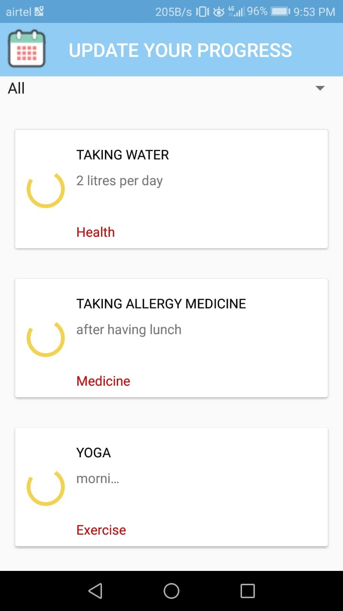

# Keep track of the goal

The user can come and access this feature once they have completed the goal each day. Once they have completed the goal in the duration that they gave, the goal will be updated as a completed goal on the achievement page.

